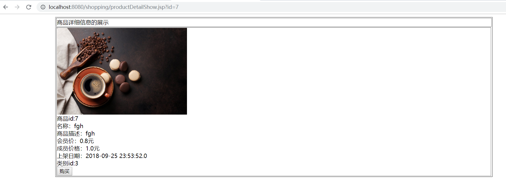
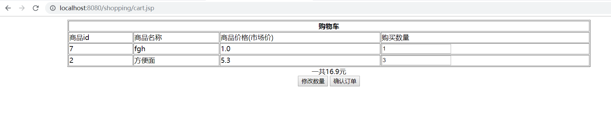
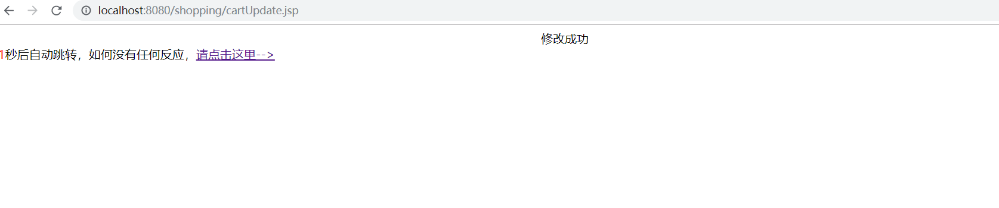
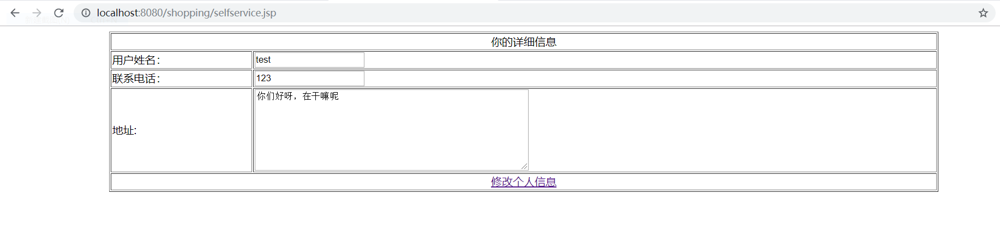
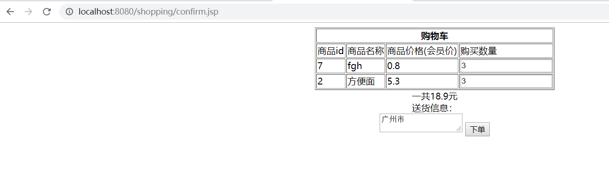
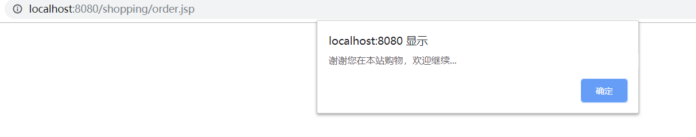
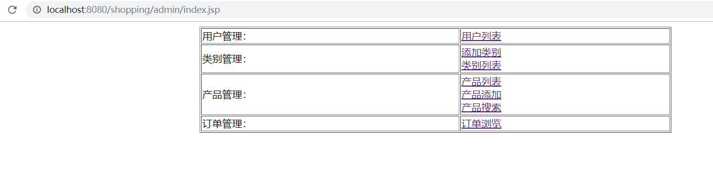
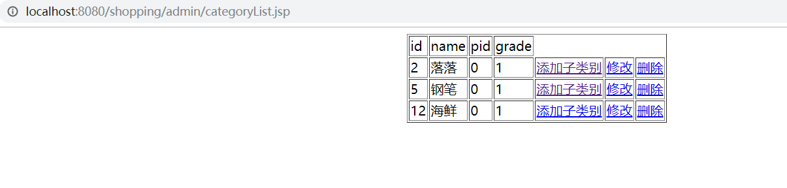
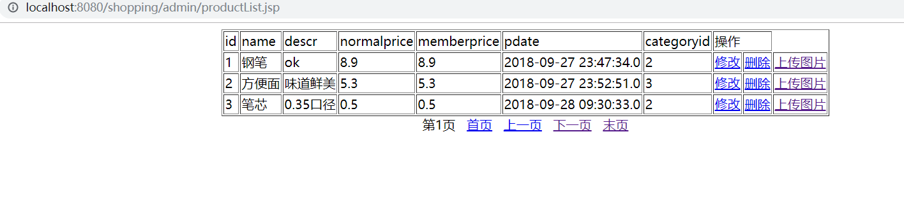

这是一个使用jsp+servlet做的一个电商项目，之前是在eclipse做的，现在转到idea
环境： idea、mysql5.7、tomcat9.0
功能包含了许多,电商大多的功能都已包含（购物车，订单，图片上传），下面是效果的展示：
##### 前端页面

可以点击登陆或者先进行注册，点击图片即可进入商品的详情页面

点击即可进行购买进入购物车

可以更改购买的数量

如果没有登陆会提示先登陆

登陆之后会看到个人的信息

确认购买，提交送货地址

这里没有接入支付的接口
##### 后台页面
登陆后台账号密码都为admin，看效果图

可以看到后台的功能

添加分类，可以添加子分类

带分页的产品列表

搜索分为简单和复杂搜索

查看订单

